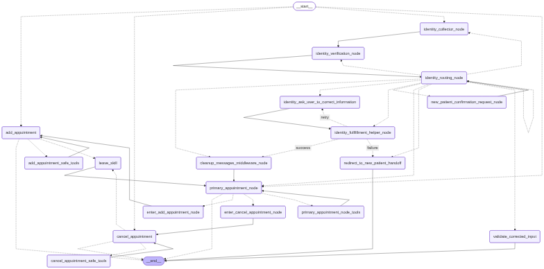

# AI-Powered Appointment Scheduling Assistant

A conversational AI assistant built with LangGraph for managing medical appointments. The system handles patient identity verification, appointment booking, cancellation, and rescheduling through natural language conversations.



## Table of Contents

- [Overview](#overview)
- [Core Functionality](#core-functionality)
  - [Identity Verification Flow](#identity-verification-flow)
  - [Appointment Management](#appointment-management)
- [State Management](#state-management)
- [Evaluation System](#evaluation-system)
- [API Endpoints](#api-endpoints)
- [Setup and Installation](#setup-and-installation)
- [Testing](#testing)
- [Development Notes](#development-notes)

## Overview

This is a multi-agent conversational system that guides users through:
1. **Identity Verification**: Collects and verifies patient information (name, DOB, phone/SSN)
2. **Appointment Management**: Books, cancels, reschedules, and lists appointments
3. **Error Handling**: Manages edge cases like new patients, urgent requests, and verification failures

The system uses LangGraph to orchestrate a state machine with specialized nodes for different conversation stages, enabling complex multi-turn dialogues with context awareness.

## Core Functionality

### Identity Verification Flow

The identity verification process is a multi-step workflow that ensures patient data is collected and verified before allowing appointment operations.

#### Flow Steps:

1. **Identity Collector Node** (`identity_collector_node`)
   - Uses structured LLM output to extract user information from conversation
   - Collects: name, date of birth, phone number (or SSN last 4)
   - Tracks urgency level and reason
   - Returns assistant message asking for missing information

2. **Completeness Validation** (`validate_identity_completness`)
   - Checks if all required fields are present:
     - Name (required)
     - Date of Birth (required)
     - Phone OR SSN last 4 (at least one required)
   - Routes:
     - `success`: All data present → proceed to verification
     - `retry`: Missing data → ask user to complete
     - `urgency`: Urgency level ≥ 8 → redirect to urgency handoff

3. **Identity Verification Node** (`identity_verification_node`)
   - Queries `UserService` to find matching user in database
   - Normalizes input (lowercase names, removes non-numeric chars from phone/SSN)
   - Matching logic:
     - Exact match: name + DOB + phone + SSN
     - Partial match: name + DOB + SSN (no phone)
     - Partial match: name + DOB + phone (no SSN)
   - Sets `user_verified = True` if found, `False` otherwise

4. **Identity Router** (`identity_routing_node`)
   - Routes based on verification status:
     - **New Patient**: If `is_new_patient = True` → handoff to new patient form
     - **Verified User**: If `user_verified = True` → proceed to appointment flow
     - **Unverified (existing)**: If `is_new_patient = False` but not verified → correction flow
     - **New Patient Confirmation**: If data complete but not verified → ask if new patient

5. **Correction Flow** (`identity_fullfillment_helper_node`)
   - Allows up to 3 correction attempts
   - After 3 failures → marks as new patient
   - Uses structured LLM to validate corrected input

6. **Handoffs**:
   - **New Patient**: Redirects to external form URL
   - **Urgency**: Directs to call 911 for emergencies

#### Key Features:
- **Interrupt System**: Uses `interrupt()` to pause graph execution and request user input
- **Structured Output**: Uses Pydantic models for reliable data extraction
- **Error Recovery**: Limited retry attempts prevent infinite loops
- **Context Cleanup**: Removes identity collection messages before appointment flow

### Appointment Management

The appointment system uses a **hierarchical delegation pattern** where a primary assistant routes to specialized assistants.

#### Primary Appointment Node

The main orchestrator that:
- Lists appointments using `list_appointments` tool
- Routes to specialized assistants via tools:
  - `ToAddAppointment`: Routes to booking assistant
  - `ToCancelAppointment`: Routes to cancellation assistant
  - `ToRescheduleAppointment`: Routes to rescheduling assistant
- Handles general appointment queries

#### Specialized Assistants

Each assistant is a self-contained node with:
- **Entry Node**: Announces the assistant's role
- **Main Node**: Handles the specific task with specialized tools
- **Tool Node**: Executes tools safely with fallback
- **Router**: Decides next step (continue, leave skill, or end)

**1. Add Appointment Assistant** (`add_appointment_node`)
- Tools: `check_appointment`, `add_appointment`
- Validates appointment details (date, time, provider)
- Checks for conflicts with existing appointments
- Normalizes doctor names (fuzzy matching)
- Suggests available times if conflicts exist

**2. Cancel Appointment Assistant** (`cancel_appointment_node`)
- Tools: `list_appointments`, `cancel_appointment_by_id`
- Lists user's appointments
- Handles ambiguity (multiple appointments on same date)
- Cancels by appointment ID

**3. Reschedule Appointment Assistant** (`reschedule_appointment_node`)
- Tools: `list_appointments`, `reschedule_appointment`
- Lists appointments for selection
- Validates new date/time
- Checks for conflicts before rescheduling

#### Appointment Stack

The system maintains an `appointment_state` stack to track nested assistant calls:
- Pushing: When entering a specialized assistant
- Popping: When leaving via `CompleteOrEscalate` tool
- Enables returning to primary assistant after task completion

#### Appointment Service

The `AppointmentService` provides:
- **CRUD Operations**: Create, read, update, delete appointments
- **Conflict Detection**: Prevents double-booking
- **Doctor Management**: Lists available doctors and their locations
- **Time Slot Management**: Calculates available appointment times
- **Search**: Finds appointments by user, date, time

## State Management

The `ConversationState` (defined in `agents/models/state.py`) is a TypedDict that tracks:

```python
{
    "user": User,                          # Patient information
    "messages": Sequence[BaseMessage],     # Conversation history
    "intents": list[Intent],               # Detected intents
    "active_intent": Intent | None,        # Current intent being processed
    "user_verified": bool,                 # Identity verification status
    "is_new_patient": bool | None,         # New vs existing patient
    "identity_fullfillment_number_of_corrections": int,  # Correction attempts
    "appointment_state": list[str],        # Appointment assistant stack
    "urgency_level": int,                  # Urgency (1-10)
    "urgency_reason": str,                 # Urgency explanation
}
```

### State Reducers

LangGraph uses reducers to merge state updates:
- **`add_messages`**: Appends new messages to conversation history
- **`add_intents`**: Merges intents (deduplicates, updates completion status)
- **`add_active_intent`**: Sets active intent (replaces previous)
- **`update_appointment_stack_reducer`**: Manages appointment state stack (push/pop)

### Checkpointing

In API mode, the graph uses `InMemorySaver` for checkpointing:
- Enables conversation persistence across requests
- Uses `thread_id` to maintain separate conversation threads
- Supports interrupt resumption

## Evaluation System

The system includes a **QA evaluation framework** for assessing conversation quality (currently **disabled**).

### Purpose

The `EvaluatorCallbackHandler` was designed to:
- Assess test case conversations automatically
- Evaluate answer quality after code changes
- Provide metrics for conversation quality

### Evaluation Metrics

The evaluator scores each QA pair on three dimensions (0-10 scale):

1. **Answer Relevance/Accuracy** (50% weight)
   - Is the answer on-topic and factually correct?

2. **User Need Relevance** (30% weight)
   - Does the answer help the user achieve their goal?

3. **Groundedness** (20% weight)
   - Is the answer supported by context, avoiding hallucinations?

**Overall Score**: Weighted average of the three dimensions

### Current Status

The evaluation is **currently turned off** in `evaluator_callback.py`:
- The callback handler is implemented but evaluation logic is commented out
- Logging infrastructure is in place (`qa_evaluator_logger`)
- To enable: Uncomment lines 125-135 in `agents/hooks/evaluator_callback.py`

### Usage

When enabled, the evaluator:
- Automatically evaluates each Human-AI message pair
- Deduplicates evaluations (tracks evaluated pairs)
- Logs scores and explanations
- Runs asynchronously to avoid blocking the main flow

## API Endpoints

### FastAPI Application

The system exposes a REST API via FastAPI:

**Base URL**: `http://localhost:8000`

#### Endpoints

**GET `/`**
- Health check endpoint
- Returns: `{"message": "Appointment Scheduler Demo API v1.0.0!"}`

**POST `/chat`**
- Main chat endpoint
- **Request Body**:
  ```json
  {
    "message": "I'd like to book an appointment",
    "thread_id": "optional-thread-id"
  }
  ```
- **Response**:
  ```json
  {
    "message": "Assistant response text",
    "thread_id": "thread-id"
  }
  ```

#### Interrupt Handling

The API handles LangGraph interrupts:
- If an interrupt is pending, the request message is used to resume
- If no interrupt, normal invocation proceeds
- Returns the interrupt question if a new interrupt is hit

#### Thread Management

- Each conversation thread is identified by `thread_id`
- If not provided, a new UUID is generated
- Thread state persists across requests (in-memory)

## Setup and Installation

### Prerequisites

- Python 3.10+
- OpenAI API key (or Gemini API key)

### Installation

1. **Clone the repository**:
   ```bash
   git clone <repository-url>
   cd <project-directory>
   ```

2. **Install dependencies**:
   ```bash
   pip install -r requirements.txt
   ```

3. **Configure environment variables**:
   Create a `.env` file in the root directory:
   ```env
   OPENAI_API_KEY=your-openai-api-key
   # OR
   GEMINI_API_KEY=your-gemini-api-key
   ```

4. **Run the API server**:
   ```bash
   python main.py
   ```
   Or using uvicorn directly:
   ```bash
   uvicorn main:app --reload --host 0.0.0.0 --port 8000
   ```

5. **Access the API**:
   - API: `http://localhost:8000`
   - Health check: `http://localhost:8000/`
   - Chat endpoint: `POST http://localhost:8000/chat`

### Environment Variables

- `OPENAI_API_KEY`: Required for OpenAI models (gpt-4.1-mini, gpt-5.1)
- `GEMINI_API_KEY`: Optional, for Google Gemini models
- `RUN_MODE`: Automatically set to `"api"` in `main.py` (enables checkpointing)

## Testing

The test suite is located in `tests/` and includes:

- `test_book_appointment.py`: Tests appointment booking flow
- `test_cancel_appointment.py`: Tests cancellation flow
- `test_reschedule_appointment.py`: Tests rescheduling flow
- `test_list_appointments.py`: Tests listing appointments
- `test_change_mind.py`: Tests user changing their mind mid-flow

Run tests using pytest:
```bash
pytest tests/
```

## Development Notes

### Adding New Appointment Operations

1. Create a new node in `agents/appointment/` (e.g., `modify_appointment_node.py`)
2. Define routing tool in the node (e.g., `ToModifyAppointment`)
3. Add node to graph in `agents/graph.py`
4. Add routing logic in `agents/appointment/appointment_router.py`
5. Update `route_primary_appointment` to handle the new tool

### Adding New Identity Verification Steps

1. Create node in `agents/identity/`
2. Add to graph workflow in `agents/graph.py`
3. Update `identity_router.py` with new routing logic
4. Add validation functions if needed

### Graph Visualization

To generate a graph visualization:
1. Uncomment lines 175-178 in `agents/graph.py`
2. Run the application
3. Graph PNG will be saved to `assets/graph.png`

### Logging

The system uses `loguru` for logging:
- **Standard logs**: General application logs
- **LLM logs** (`llm_logger`): Pretty-printed LLM inputs/outputs
- **QA Evaluator logs** (`qa_evaluator_logger`): Evaluation metrics (when enabled)

Logs are colorized and formatted for readability.

### State Persistence

Currently uses `InMemorySaver` for checkpointing:
- State is lost on server restart
- For production, consider:
  - PostgreSQL checkpointer
  - Redis checkpointer
  - Custom checkpointer implementation

### Error Handling

- **Appointment Conflicts**: Handled via `AppointmentConflictError`
- **Not Found Errors**: Handled via `AppointmentNotFoundError`
- **Multiple Matches**: Handled via `MultipleAppointmentsFoundError`
- **HTTP Exceptions**: Unified exception handler in `main.py`

### Performance Considerations

- LLM calls are async (`ainvoke`) for non-blocking execution
- Models are cached as singletons to avoid re-initialization
- Timeout and retry logic prevents hanging requests

---

**Built with**: LangGraph, LangChain, FastAPI, OpenAI GPT**
