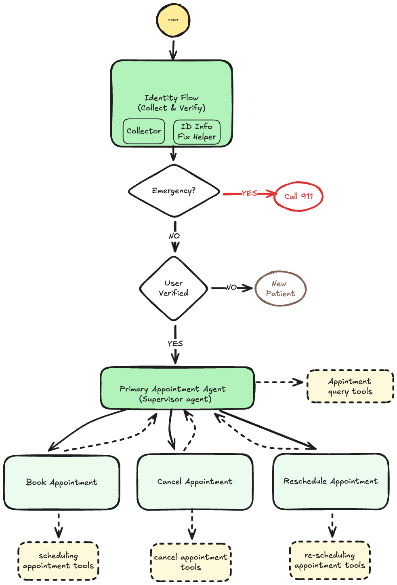

# AI-Powered Appointment Scheduling Assistant

A conversational AI assistant built with LangGraph for managing medical appointments. Handles patient identity verification, appointment booking, cancellation, and rescheduling through natural language conversations.



## What It Can Handle

### Identity Verification
- Collects patient information (name, DOB, phone/SSN)
- Verifies existing patients against database
- Handles new patient registration
- Corrects incorrect information with retry attempts (preventing guessing)
- Detects urgent requests and escalates appropriately
- Captures user intent during identity collection to avoid re-stating when transitioning to appointment management (context is wiped between agents to reduce hallucinations)

### Appointment Management
- **Book appointments**: Validates dates, times, and providers; checks for conflicts
- **Cancel appointments**: Lists appointments, handles ambiguity, cancels by ID
- **Reschedule appointments**: Lists appointments, validates new times, detects collisions
- **List appointments**: Shows all upcoming appointments sorted by date/time
- **Long-term memory**: Remembers new doctor preferences when users don't go with their usual doctor, so the new preference is used for future appointments

### Error Handling
- Appointment conflicts with automatic alternative suggestions
- Missing or incorrect information with clarification requests
- Multiple appointment matches with disambiguation
- Invalid date/time formats with normalization
- Doctor name matching with fuzzy search

## Example Conversation: Rescheduling with Corrections and Collisions

Here's a realistic conversation flow showing how the assistant handles incorrect information and appointment conflicts:

```
User: I need to reschedule my appointment

Assistant: I'd be happy to help you reschedule your appointment. Let me first verify your identity. 
           Could you please provide your name, date of birth, and phone number or SSN last 4 digits?

User: John Doe, January 1st 1960, phone is 555-1234

Assistant: Thank you. I found your account. Which appointment would you like to reschedule?

User: The one tomorrow at 2pm

Assistant: I found your appointment with Dr. Smith on 2025-12-15 at 14:00. 
           What date and time would you like to reschedule it to?

User: December 20th at 3pm

Assistant: I can reschedule your appointment to December 20, 2025 at 15:00 with Dr. Smith. 
           Would you like me to confirm this? (yes/no)

User: Actually, make it December 18th at 2:30

Assistant: I can reschedule your appointment to December 18, 2025 at 14:30 with Dr. Smith. 
           Would you like me to confirm this? (yes/no)

User: yes

Assistant: I'm sorry, but that time slot is already booked. The doctor has an appointment at 14:30 on December 18th. 
           Here are some available times on that date: 10:00, 11:00, 13:00, 15:00, 16:00. 
           Would you like to choose one of these times, or would you prefer a different date?

User: How about 15:00 on December 18th?

Assistant: I can reschedule your appointment to December 18, 2025 at 15:00 with Dr. Smith. 
           Would you like me to confirm this? (yes/no)

User: yes, please reschedule it

Assistant: Perfect! I've successfully rescheduled your appointment to December 18, 2025 at 15:00 with Dr. Smith. 
           Your appointment has been updated in the system.
```

### Key Features Demonstrated

1. **Identity Verification**: Collects and verifies patient information before proceeding
2. **Information Correction**: User changes their mind about the date/time, assistant adapts
3. **Conflict Detection**: System detects appointment collision and suggests alternatives
4. **Natural Conversation**: Handles multiple corrections and clarifications smoothly
5. **Confirmation Flow**: Asks for confirmation before making changes

## Quick Start

### Prerequisites
- Python 3.10+
- OpenAI API key (or Gemini API key)

### Installation

1. **Install dependencies**:
   ```bash
   pip install -r requirements.txt
   ```

2. **Configure environment variables**:
   Create a `.env` file:
   ```env
   OPENAI_API_KEY=your-openai-api-key
   # OR
   GEMINI_API_KEY=your-gemini-api-key
   ```

3. **Run the API server**:
   ```bash
   python main.py
   ```

4. **Access the API**:
   - Health check: `GET http://localhost:8000/`
   - Chat endpoint: `POST http://localhost:8000/chat`

### API Usage

**POST `/chat`**
```json
{
  "message": "I'd like to book an appointment",
  "thread_id": "optional-thread-id"
}
```

**Response:**
```json
{
  "message": "Assistant response text",
  "thread_id": "thread-id"
}
```

## Architecture

### Multi-Agent System
- **Identity Agent**: Handles patient verification and data collection
- **Primary Appointment Agent**: Routes to specialized assistants
- **Specialized Assistants**: Booking, cancellation, and rescheduling agents

### State Management
Uses LangGraph for stateful conversation management with checkpointing for persistence.

### Tools & Services
- **AppointmentService**: CRUD operations, conflict detection, doctor management
- **UserService**: Patient lookup and verification
- **Structured Tools**: Type-safe tool calling with Pydantic validation

## Testing

Run the test suite:
```bash
pytest tests/
```

Test files:
- `test_book_appointment.py`: Booking flow
- `test_cancel_appointment.py`: Cancellation flow
- `test_reschedule_appointment.py`: Rescheduling flow
- `test_list_appointments.py`: Listing appointments
- `test_change_mind.py`: User changing mind mid-flow

## Development

### Adding New Features

1. **New Appointment Operations**: Create node in `agents/appointment/`, add routing in `appointment_router.py`
2. **Identity Steps**: Create node in `agents/identity/`, update `identity_router.py`
3. **Graph Updates**: Modify `agents/graph.py` to add new nodes and edges

### Graph Visualization

Uncomment lines 175-178 in `agents/graph.py` and run the app to generate `assets/graph.png`.

---

**Built with**: LangGraph, LangChain, FastAPI, OpenAI GPT
